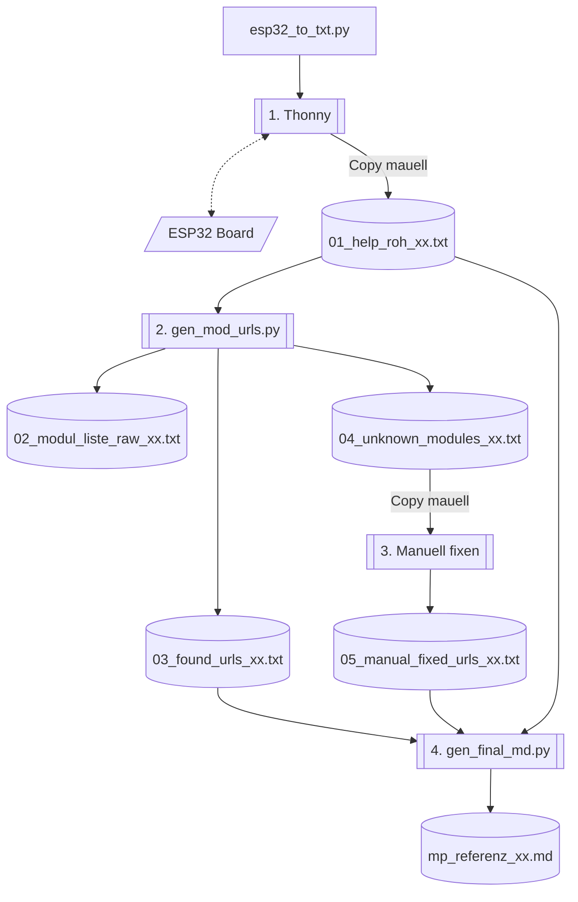
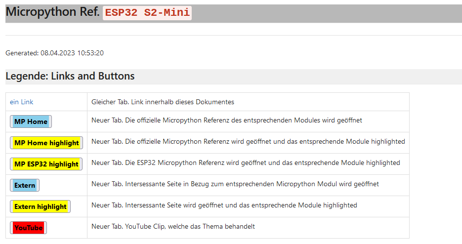
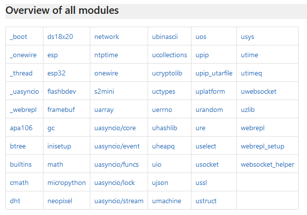
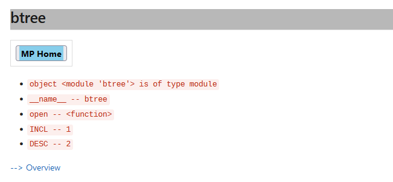
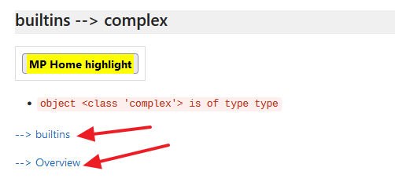
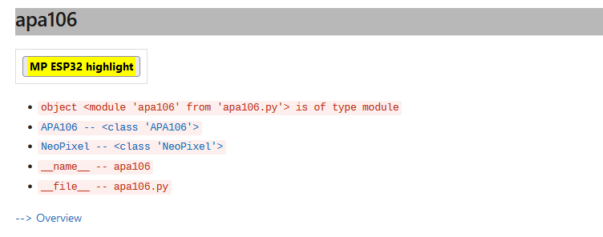
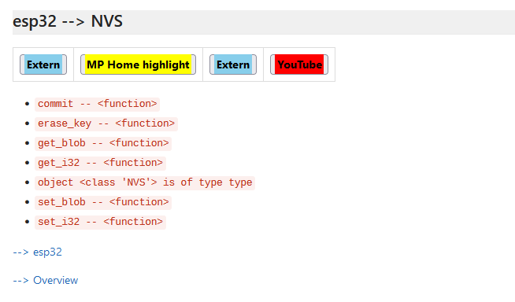
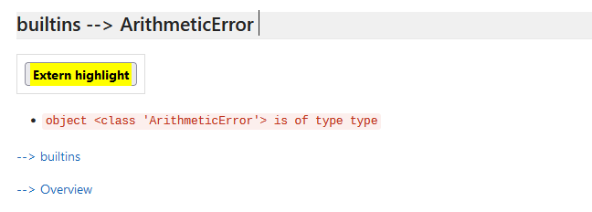

# Micropython Manual für ESP32

## Sinn und Zweck

Die Micropython (MP) Hilfe ist etwas düftig. Mit Hilfe dieses Projektes können im Moment für die Boards ESP32 DOIT und S2-Mini
das Hilfe Manual `mp_referenz_xx.md` generiert werden.

  - [Manual für ESP32 DOIT](./data/mp_referenz_final_DOIT.md)
  - [Manual für ESP32-S2 Mini](./data/mp_referenz_final_S2-Mini.md)

## Ablauf



### 1. Skript mit Thonny ausführen (nur erstes Mal pro Board)

Sobald Thonny mit einem Micropython fähigen Board verbunden ist, kann das Skript `esp32_to_txt.py` ausgeführt werden. Der Output wird in das File `01_help_roh_xx.txt` kopiert. Dieses File stellt nun die Basis für den weiteren Ablauf dar.

### 2. Hilfe URL pro Modul ermitteln (nur erstes Mal pro Board)

Das Programm `gen_mod_urls.py` ist ein Python 3 Skript. Als Input dient die zuvor erstellte Datei `01_help_roh_xx.txt`. Aus ihr werden die Modules extrahiert und für jedes Modul wird versucht, eine Hilfe Seite zu finden. Es werden dabei drei Dateien erstellt:

  * `02_modul_liste_raw_xx.txt` Hier sind alle gefunden Module in sortierter Reihenfolge aufgeführt
  * `03_found_urls_xx.txt` In dieser Datei sind alle Module mit einem entsprechenden Link auf eine Hilfe Seite in sortierter Reihenfolge aufgelistet
  * `04_unknown_modules_xx.txt` Hier sind nun alle Module aufgeführt, für die kein Link gefunden wurde. Dies muss nun im nächsten Schritt ergänz werden.

Die Dateien sind hier durch die Substitution `xx` gekennzeichnet. Dieser Suffix wird in Abhängigkeit des Boards erstellt:

  * ESP32 DOIT: Suffix `DOIT`
  * ESP32 S2-Mini: Suffix `S2-Mini`


### 3. URLs manuell ergänzen

Wenn die Datei `05_manual_fixed_urls_xx.txt` noch nicht existiert, muss sie von Hand durch eine Kopie von `04_unknown_modules_xx.txt` erstellt werden. In dieser Datei kann für jedes Modul einer oder auch mehrere Links hinzugefügt werden. Es ist auch möglich, YouTube Videos zu verlinken, wobei einfach der Link des Videos aus dem Browser Kopiert wird. Hier ein Bespiel:

```
dht.DHTBase
esp32.NVS, https://docs.micropython.org/en/v1.19/library/esp32.html?highlight=NVS
esp32.NVS, https://docs.espressif.com/projects/esp-idf/en/latest/esp32/api-reference/storage/nvs_flash.html
esp32.NVS, https://www.youtube.com/watch?v=CX5-dAmOxRc
esp32.NVS, https://insigh.io/blog/over-the-air-switch-from-esp-idf-to-micropython/
esp32.Partition, https://docs.micropython.org/en/latest/library/esp32.html?highlight=Partition
flashbdev, https://docs.micropython.org/en/v1.19/reference/filesystem.html?highlight=flashbdev
flashbdev.Partition, https://docs.micropython.org/en/v1.19/reference/filesystem.html?highlight=Partition
framebuf.FrameBuffer, https://docs.micropython.org/en/latest/library/framebuf.html
```

Sollten auch Links für weitere Module bereitgestellt werden, können diese aus der Datei `02_modul_liste_raw_xx.txt` für die geünschten Module gefunden werden.

### 4. Finale Hilfe generieren

Die Generierung des eigentlichen Ziels, nämlich der Datei `mp_referenz_xx.md`, erfolgt mit dem Python 3 Skript `gen_final_md.py`. Dieser Skript liest die drei zuvor besprochenen Dateien ein und erzeugt aus ihnen das gewünschte Resultat.

# Beispiel Ausschnitte aus der Hiledatei




Die Legende zu den Link und Buttons und deren Bedeutung




Übersicht aller Module, welche Micropython kennt. Jeder Link verweisst auf das entsprechende Modul im Dokument.




Link auf die Micropython Homepage und das entsprechende Modul, hier als Beispiel `btree`.



Das Submodule `complex` vom Modul `builtins`. Mit dem Link `builtins` wird auf das Modul zurückgesprungen und mit dem Link `Overview` zur Übersicht.
Der Button zeigt, dass auf die Homepage von Micropython gesprungen wird jedoch das Submodul nicht als Haupttitel vorhanden ist. Vielmehr werden alle Vorkommen des Submodules in der Seite markiert.




Der Button verweist auf die Micropython Spezialseite des ESP32 und die Vorkommen des Submodules werden markiert




Hier ist ein Beispiel von mehrern Buttons, d.h. es sind in der Datei `05_manual_fixed_urls_xx.txt` mehrere Links für diese Submodul von Hand eingetragen worden.




Mit diesem Link wird auf eine exterene Seite verwiesen, wobei das Submodul nicht als Haupttitel vorhanden ist, vielmehr werden alle Vorkommen des Submodules in der Seite markiert.


# Programm Start

Die beiden Generator Python Skripts akzeptieren ein Argument, aufgrund dessen der entsprechende Suffix erstellt wird. Die Argumente sind:

  * `d` oder `D` für ESP32 DOIT
  * `s2` oder `S2` für ESP32 S2-Mini

## Programm über die Windows CMD starten

Die Shell muss auf das Verzeichnis `src_generator` zeigen, dann sieht der Befehl wie folgt aus:

  * `python gen_mod_urls.py s2` für den ESP32 S2-Mini
  * `python gen_mod_urls.py d` für ESP32 DOIT

Das Gleiche gilt natürlich auch für das Skript `gen_final_md.py`
