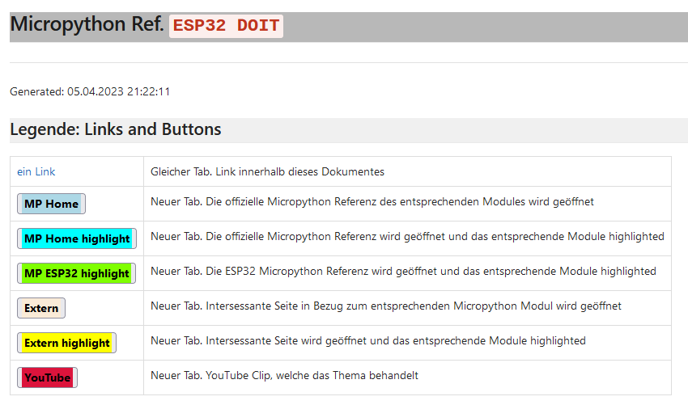
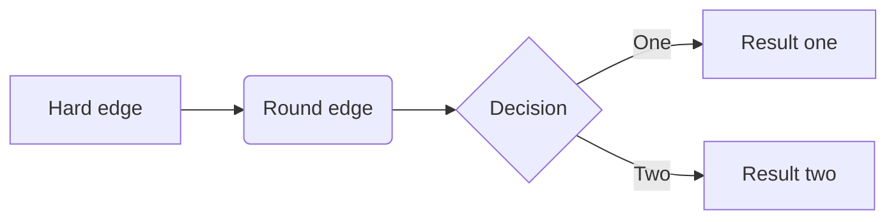

# Micropython Manual für ESP32

## Sinn und Zweck

Die Micropython (MP) Hilfe ist etwas düftig. Mit Hilfe dieses Projektes können im Moment für die Boards ESP32 DOIT und S2-Mini
das Hilfe Manual generiert werden.

